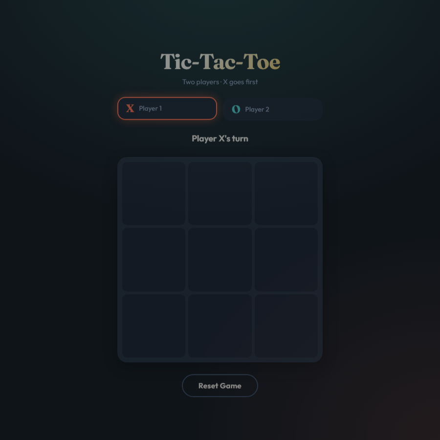

# Tic-Tac-Toe

A modern, single-page Tic-Tac-Toe game for two players. Built with plain HTML, CSS, and JavaScript — no frameworks or build step required.



## Interactive Demo

**[Play Tic-Tac-Toe](https://ktuladhar.github.io/tic-tac-toe-game/)** — try the game in your browser, no download required.

## Features

- **Two-player gameplay** — take turns placing X and O on a 3×3 grid
- **Turn indicator** — status message and highlighted player card show whose turn it is
- **Win & draw detection** — automatically detects a winner or a full-board draw
- **Winning line highlight** — the three winning cells are visually emphasized
- **Invalid move prevention** — played cells are disabled and cannot be clicked again
- **Reset button** — start a fresh game at any time
- **Responsive design** — works on desktop and mobile screens
- **Accessible** — keyboard-focusable cells, ARIA labels, and live status updates

## Tech Stack

| Layer      | Technology        |
|------------|-------------------|
| Structure  | HTML5             |
| Styling    | CSS3 (Grid, Flexbox, custom properties) |
| Logic      | Vanilla JavaScript |

## Project Structure

```
tic_tac_toe_game/
├── index.html        # Page structure and game board
├── styles.css        # Layout, theme, and animations
├── script.js         # Game logic and event handling
├── docs/
│   └── screenshot.png  # Game preview image
├── .github/
│   └── workflows/
│       └── deploy.yml  # GitHub Pages deployment
├── tutorial.md       # Beginner-friendly walkthrough
└── README.md         # This file
```

## Getting Started

### Option 1: Open directly

1. Clone or download this repository.
2. Open `index.html` in any modern web browser.

### Option 2: Local server

```bash
cd tic_tac_toe_game
npx serve .
```

Then open the URL shown in the terminal (typically `http://localhost:3000`).

> An internet connection is needed on first load to fetch Google Fonts (Fraunces and Outfit).

## How to Play

1. Player **X** goes first.
2. Click an empty cell to place your mark.
3. Players alternate until someone gets three in a row, or the board is full (draw).
4. Click **Reset Game** to play again.

## Tutorial

New to web development? See **[tutorial.md](tutorial.md)** for a complete beginner's guide covering HTML structure, CSS styling, JavaScript game logic, and how the three files work together.

## Browser Support

Works in all modern browsers that support CSS Grid and ES6 JavaScript (Chrome, Firefox, Safari, Edge).

## License

MIT
